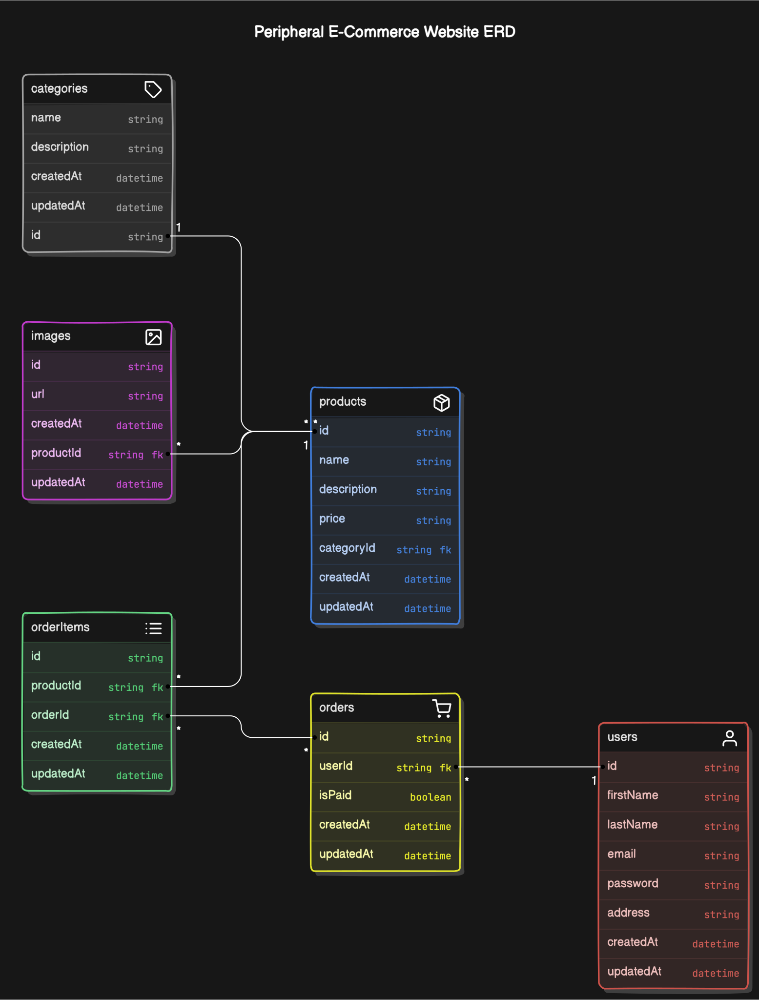

# KIYS PROJECT

KIYS is an innovative online platform dedicated to meeting all your peripheral needs, specializing in a wide range of cutting-edge tech products essential for enhancing your digital experience. From high-performance keyboards and precision mice to immersive headphones and top-of-the-line True Wireless Stereo (TWS) devices, KIYS offers a diverse selection of premium peripherals designed to elevate your computing and entertainment setups.

With a focus on quality, functionality, and user experience, KIYS sets itself apart as a go-to destination for tech enthusiasts and professionals seeking reliable and stylish accessories for their devices. Our carefully curated collection of peripherals not only caters to the demands of modern software developers but also aligns with the latest trends in the ever-evolving tech industry.

Whether you are a seasoned developer looking to optimize your workflow with responsive input devices or a casual user in search of sleek and durable peripherals, KIYS provides a seamless shopping experience backed by detailed technical documentation. Our commitment to transparency and customer satisfaction ensures that you can make informed decisions based on comprehensive product information, specifications, and compatibility details, empowering you to choose the perfect peripherals that suit your specific needs.

At KIYS, we understand the importance of reliable tools in software development, and our dedication to delivering high-quality peripherals is evident in every product we offer. Explore our website today and discover how KIYS can enhance your computing experience with top-tier peripherals tailored to meet the demands of the tech-savvy community.

## Link

- UI Design : [Figma](https://www.figma.com/design/jYd73GGy8MLq3oL6eUf0nm/%5BBootcamp%5D---Kiys-Ecommerce?node-id=3-734&t=Cq8HKaval7SDjBZ6-1)
- Frontend :
  - Repository :
  - Deployment :
- Backend :
  - Repository : [kiys-backend](https://github.com/chianyungcode/kiys-backend)
  - Deployment :

Inspirations :

- [Nuphy](https://nuphy.com)
- [Keychron](https://keychron.com)
- [Moondrop](https://moondroplab.com)

## ERD

## Key Features

- Search Products
- Checkout product
- User registration and login
- Product filtering and sorting
- Product reviews and ratings
- Related product recommendations
- Wishlist functionality
- Newsletter subscription
- Mobile responsiveness

## Pages

- Home Page
- Category Page
- Product Detail Page
- Cart Page
- Checkout Page
- About Page
- Search Page
- Contact Page
- User Account Page (Login, Register, Profile)
- Order History Page
- Wishlist Page
- FAQ Page
