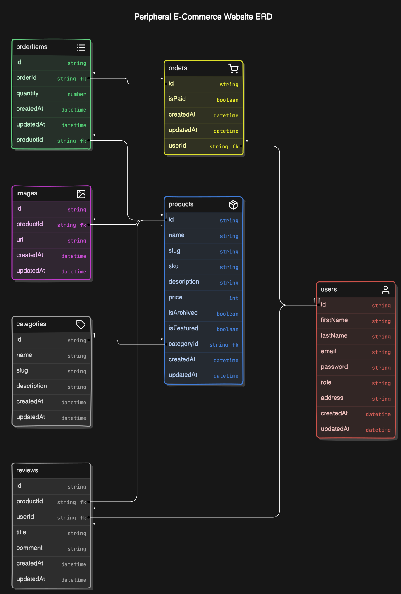

# KIYS PROJECT

KIYS is an online platform specializing in cutting-edge tech products to enhance your digital experience. They offer a diverse selection of premium peripherals like keyboards, mice, headphones, and True Wireless Stereo (TWS) devices. KIYS focuses on quality, functionality, and user experience, making them a go-to destination for tech enthusiasts and professionals. Their curated collection caters to developers and aligns with the latest tech trends. Whether you're a developer or a casual user, KIYS provides a seamless shopping experience with detailed technical documentation for informed decisions. Their commitment to transparency and customer satisfaction ensures you find the perfect peripherals for your needs, enhancing your computing experience. Explore KIYS today for top-tier peripherals tailored for the tech-savvy community.

## Link

- UI Design : [Figma](https://figma.com)
- Frontend :
  - Repository : [kiys-vite](https://github.com/chianyungcode/kiys-storefront-2)
  - Deployment :
- Backend :
  - Repository : [kiys-backend](https://github.com/chianyungcode/kiys-backend)
  - Deployment :

Inspirations :

- [Nuphy](https://nuphy.com)
- [Keychron](https://keychron.com)
- [Moondrop](https://moondroplab.com)

## ERD

## Key Features

- Search Products
- Checkout product
- User registration and login
- Product filtering and sorting
- Product reviews and ratings
- Related product recommendations
- Wishlist functionality
- Newsletter subscription
- Mobile responsiveness

## Pages

- Home Page
- Category Page
- Product Detail Page
- Cart Page
- Checkout Page
- About Page
- Search Page
- Contact Page
- User Account Page (Login, Register, Profile)
- Order History Page
- Wishlist Page
- FAQ Page
